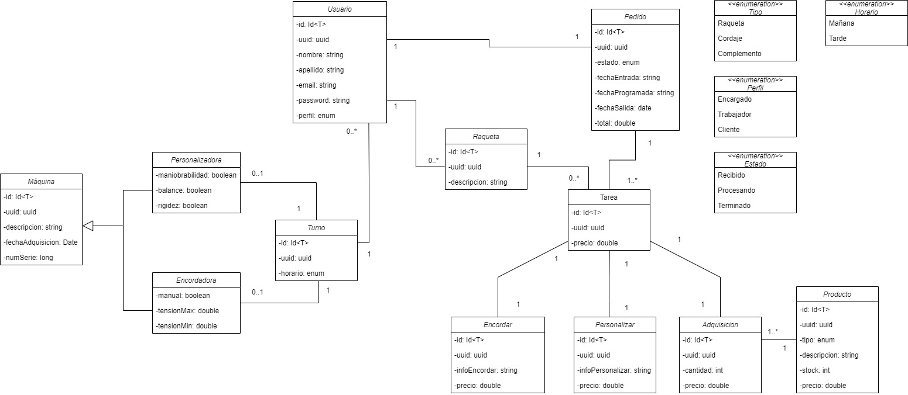

# TennisLab

Proyecto de gestión de base de datos de una tienda de raquetas para la asignatura Acceso a Datos del IES Luis Vives
(Leganés).

# Versión MongoDB

## [Versión MongoDB + Spring Data](https://github.com/Mario999X/tennislab-MongoDB-SpringData-Reactivo)

## [Vídeo de presentación]

## Índice

- [Diseño](#diseño)
- [Estructura del proyecto](#estructura-del-proyecto)
- [Funcionamiento de la aplicación](#funcionamiento-de-la-aplicación)
- [Tests](#tests)
- [Autores](#autores)

# Diseño

## Introducción

Para la realización de este proyecto, se puso de requisito diseñarla usando MongoDB de manera reactiva.

La **documentación** se encuentra en el directorio **"documentation"** en la raíz del proyecto, además del enunciado del
problema.

El primer paso fue el diseño del *diagrama de clases*, cuyo resultado final fue el siguiente:

## Diagrama de clases

Las distintas relaciones se encuentran completamente explicadas y detalladas en la *documentación*.

## Configuración del proyecto

La configuración del proyecto se realizó utilizando [Gradle](https://gradle.org/); nos apoyamos en las siguientes
tecnologías:

- [Mockk](https://mockk.io/)
- [Corrutinas Kotlin](https://kotlinlang.org/docs/coroutines-overview.html)
- [KMongo](https://litote.org/kmongo/)
- [Logger](https://github.com/oshai/kotlin-logging)
- [Serialization Kotlin JSON](https://github.com/Kotlin/kotlinx.serialization)
- [BCrypt](https://github.com/ToxicBakery/bcrypt-mpp)
- [Koin](https://insert-koin.io/)
- [KSP](https://github.com/google/ksp)
- [KtorFit](https://plugins.gradle.org/plugin/de.jensklingenberg.ktorfit)
- [Cache4k](https://github.com/ReactiveCircus/cache4k)
- [Dokka](https://github.com/Kotlin/dokka)
- [KDoc](https://kotlinlang.org/docs/kotlin-doc.html)
- [JUnit5](https://junit.org/junit5/)

## Configuración de la base de datos

Luego de proponer las distintas opciones de uso de MongoDB, acabamos
eligiendo [MongoDB Atlas](https://www.mongodb.com/atlas/database), que nos permite conectarnos de manera rápida y
sencilla.

La base de datos trabaja de forma reactiva, esto se puede ver en la clase *"MongoDbManager"* y en el uso de corrutinas y
flujos a lo largo de la aplicación.

# Estructura del proyecto

Para mantener el proyecto ordenado, se opto por una estructuración de clases referenciando sus
funciones, dando como resultado los distintos paquetes como: *"Models", "Repositories"...*

## Documentación

Las clases se encuentran documentadas con KDoc, y hemos implantado **Dokka** para poder presentar una documentación en
formato *HTML*.

Luego, en la raíz del proyecto, en el directorio *"documentation"*, se encuentra la documentación en formato *PDF* que
detalla el proyecto en gran medida.

# Funcionamiento de la aplicación

Contamos con dos clases principales fuera del resto de paquetes de organización, *App* y *Main*

## App

Extendiendo de *KoinComponent*, es donde se realizarán las operaciones CRUD sobre la base de datos;
realizará una limpieza sobre todas las colecciones para siempre tener los datos de la ejecución actualizada del
programa,
prepararemos la opción de escuchar cambios a tiempo real sobre la colección de **"productos"**, y cargaremos
al completo a los usuarios, que serán obtenidos del siguiente
[servicio externo]("https://jsonplaceholder.typicode.com/").

Los usuarios serán obtenidos con la llamada correspondiente usando **KtorFit**, y serán almacenados al mismo tiempo
tanto en *MongoDB* como en una *cache*, diseñada en base a **Cache4k**;
esta última se refrescara cada minuto de forma automática.

Todos los CRUD realizados se realizan en el mismo orden: CREATE -> FIND ALL -> FIND BY ID -> UPDATE -> DELETE,
realizando llamadas a los distintos controladores, inyectados usando **Koin**.

También, un componente básico de la APP son las **Tareas**, que una vez creadas, además de ser almacenadas en MongoDB,
serán súbidas a un [servicio externo]("https://jsonplaceholder.typicode.com/").

Finalmente, una vez hemos realizado todas las operaciones, cancelamos los escuchadores de *productos*.

## Main

Esta será la clase de ejecución principal, que nos permite utilizar las inyecciones de dependencias.

La aplicación funcionará hasta que el usuario la detenga a mano, durante ese tiempo la cache de usuarios
seguirá tratando de actualizarse.

## Ejecución

Hemos configurado el proyecto para que, una vez construido, tengamos un jar que permita su ejecución.

Además, hemos usado **Jackson** para visualizar los elementos de la terminal en formato *JSON*.

Para ver los resultados de ejecución, ademas de la implementación de mensajes por terminal, hemos usado la propia
página de *MongoDB Atlas*, o el plugin *MongoDB* de **Visual Studio Code** para visualizar
los cambios sobre la base de datos.

# Tests

Hemos realizado los test tanto de **controladores** como de **repositorios**, haciendo uso de **Mockk** y **JUnit5**,
además, son test que permiten la actuación de corrutinas.

# Autores

[Sebastián Mendoza](https://github.com/SebsMendoza) y [Mario Resa](https://github.com/Mario999X)